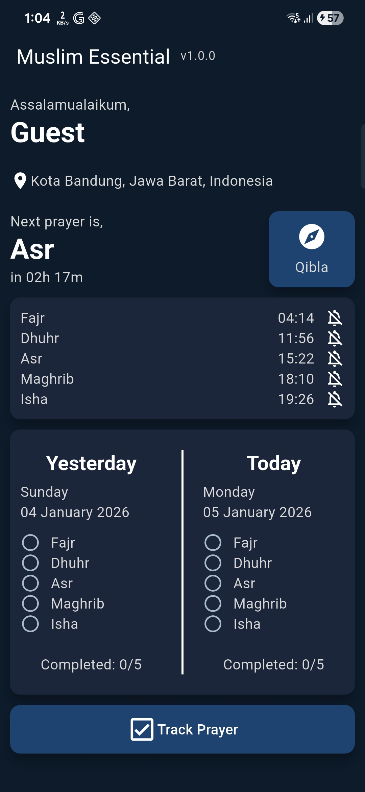

# Muslim Essential

A modern, lightweight prayer time app for Muslims. It automatically displays daily prayer schedules
based on the user's location, complete with adhan notifications, a Qibla compass, and a personal 
prayer tracking feature. Designed for simplicity and offline functionality.

## 📸 Screenshots

### Main menu


### Authentication
<table>
  <tr>
    <td>
      
    </td>
    <td>
      
    </td>
    <td>
      
    </td>
  </tr>
</table>

## ✨ Features

- **Prayer Times**: Automatically fetches and displays prayer times based on your device's current location.
- **Cloud Sync with Firebase**: User login via Google Sign-In, with prayer tracking data securely stored and synced in the cloud.
- **Adhan Notifications**: Receive timely notifications for each prayer time.
- **Qibla Compass**: An easy-to-use compass to find the direction of the Qibla.
- **Prayer Tracker**: A personal feature to help you track your daily prayers.
- **Works Offline**: Core features are available without an active internet connection after the initial setup.
- **Modern UI**: A clean, intuitive, and user-friendly interface.

## 🛠️ Tech Stack
- **Framework**: Flutter
- **Authentication**: Firebase Authentication (Google Sign-In)
- **Cloud Database**: Firebase Firestore (for prayer tracking data)
- **Prayer Time Engine**: [adhan_dart](https://pub.dev/packages/adhan_dart)
- **Local Database**: [ObjectBox](https://pub.dev/packages/objectbox)
- **Notifications**: [flutter_local_notifications](https://pub.dev/packages/flutter_local_notifications)
- **Location**: [geolocator](https://pub.dev/packages/geolocator)

## 🚀 Getting Started

Follow these instructions to get a copy of the project up and running on your local machine for development and testing purposes.

### Prerequisites
- Flutter SDK: Ensure you have Flutter installed. For installation guides, see the official Flutter documentation.
- IDE: Android Studio or VS Code (with the Flutter extension).
- Firebase

### Installation
1. Install the FlutterFire CLI: If you don't have it installed, run this command in your terminal:
    ```bash
    dart pub global activate flutterfire_cli
   ```

2. Clone the repository:
   ```bash
    git clone https://github.com/your-username/muslim-essential.git
    cd muslim-essential
   ```

3. Set up Firebase:
   - Go to the Firebase Console and create a new project.
   - Add an Android and/or iOS app to your Firebase project. Follow the on-screen instructions.
   - Enable Authentication -> Sign-in method -> Google.
   - Enable Firestore Database.
   - Download the google-services.json (for Android) and GoogleService-Info.plist (for iOS) files and place them in the correct directories as instructed by Firebase.
   
4. Configure Firebase in Flutter: From the root of your project folder (muslim-essential), run the following command. This will connect your Flutter app to your Firebase project and generate the required lib/firebase_options.dart file.
    ```bash
    flutterfire configure
   ```

5. Install Flutter dependencies :
    ```bash
    flutter pub get
   ```
6. Run the project :
    ```bash
    flutter pub run
   ```
## 🤝 How to Contribute

Contributions, issues, and feature requests are welcome! Feel free to check the issues page.
1. Fork the project.
2. Create your Feature Branch (git checkout -b feature/AmazingFeature).
3. Commit your changes (git commit -m 'Add some AmazingFeature').
4. Push to the branch (git push origin feature/AmazingFeature).
5. Open a Pull Request.
